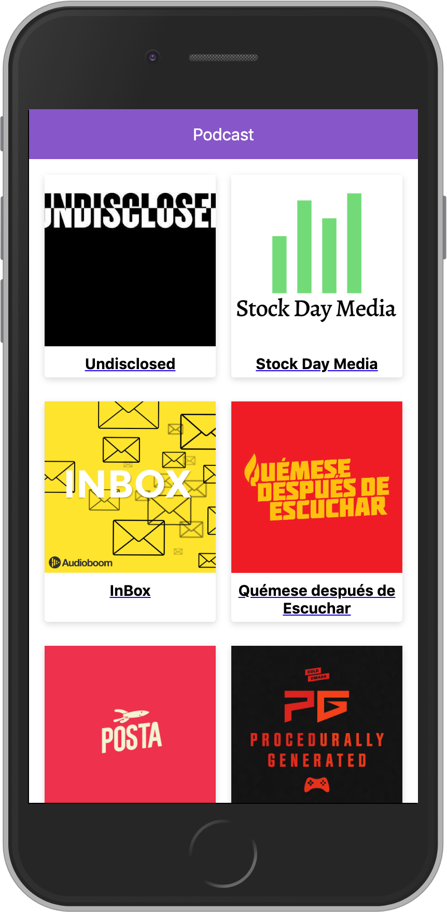

# Curso de next.js by platzi 🚀

App de podcast integrada con la API de audioBoom para aprender next.js 





## Scripts

```
    "dev": "node server.js",
    "build": "next build",
    "start": "NODE_ENV=production node server.js"
````


[Click aqui para ver el proyecto en linea 🔥](https://podcast.lfotecam.now.sh/)
